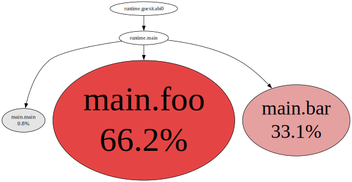

# Yap

Yet Another Profiler written in Go and eBPF

> This is an experimental project. Use at your own risk.

This is a low-overhead kernel-assisted sampling-based CPU time continuous profile. It does not need instrumentation in the profiled binary.

A simple sampling eBPF program attached to a timer collects:
- stack traces
- sampled stack trace counts

The data collected from the kernel is analysed in user-space to summarise residency fraction.
That is, for a stack trace, the percentage of samples that contained that path out of the total amount of samples.

This information extracted from the collected data expresses, for a specific process, which functions are mostly executing.

## How it works

The sampling eBPF probe is attached to a perf [CPU clock software event](https://elixir.bootlin.com/linux/v6.8.5/source/include/uapi/linux/perf_event.h#L119).

The user and kernel stack traces that are running on the current CPU are available to the eBPF program that will run in the context of the interrupted process via the [`bpf_get_stackid`](https://elixir.bootlin.com/linux/v6.8.5/source/kernel/bpf/stackmap.c#L283) eBPF helper.
The user or kernel stack will be available depending on the context during which the process was interrupted.

The hard work of stack walking is made easy by the Linux kernel thanks to the fact that frame instruction pointers of the sampled stack traces are available in kernel space via the [`BPF_MAP_TYPE_STACK_TRACE`](https://elixir.bootlin.com/linux/v6.8.5/source/include/uapi/linux/bpf.h#L914) eBPF map.

The information about how much a specific stack has been sampled is tracked with counters stored in an histogram eBPF map, which is keyed by:
- User stack ID
- Kernel stack ID
- PID to filter later on

and made available to userspace, alongside the stack traces.

In userspace symbolization is made with frame instruction pointer addresses and the ELF symbol table.

Finally, the information is extracted as percentage of profile time a stack trace has been executing.

## Current limitations

Due to the current implementation there are some limitations on the supported binaries to make CPU profiling properly work and finally provide a meaningful report:
* because it leverages frame pointers for stack unwinding, binaries compiled without frame pointers are not currently supported.
* because it leverages the ELF symbol table (`.symtab` section) for the symbolization, stripped binaries are not supported in the current version. By the way, debug symbol are not required to be included in the final binary to make symbolization properly work.

## Quickstart

## Usage

```
yap profile [--debug] --pid PID
Options:
  -debug
      Sets log level to debug
  -pid int
      The PID of the process
```

For a detailed reference please refer to the [CLI reference](./docs) documentation.

### Example

Considering a go program made it running in background:

```shell
go build -v -o myprogram
./myprogram &
[1] 95541
```

Let's profile it:

```shell
sudo yap profile --pid 95541
{"level":"info","message":"collecting data"}
^C{"level":"info","message":"terminating..."}
Residency Stack trace
 2.6%     main.main;runtime.main;runtime.goexit.abi0;
65.3%     main.foo;runtime.main;runtime.goexit.abi0;
32.1%     main.bar;runtime.main;runtime.goexit.abi0;
```

### Graphviz support

`yap` can generate a DOT graph to be rendered by specifying the `--output=dot` to the `profile` command.

Considering a profile similar to the one from the example above, a DAG would be generated like below:



## Build

### Prerequisites

* clang
* libbpf-dev
* libelf (optional: required to build bpftool)
* zlib (optional: required by bpftool)

### Build all

```shell
make yap
```

### eBPF probe only

```shell
make yap/bpf
```

## Credits

- Pixie:
  - [pixie-demos/ebpf-profiler](https://github.com/pixie-io/pixie-demos/tree/main/ebpf-profiler)
  - [Building a continuous profiler](https://blog.px.dev/cpu-profiling/)
- Linux:
  - [samples/bpf/trace_event_user.c](https://github.com/torvalds/linux/blob/8f2c057754b25075aa3da132cd4fd4478cdab854/samples/bpf/trace_event_user.c)
  - [samples/bpf/trace_event_kern.c](https://github.com/torvalds/linux/blob/8f2c057754b25075aa3da132cd4fd4478cdab854/samples/bpf/trace_event_kern.c)
- Brendan Gregg:
  - [Linux eBPF Stack Trace Hack](https://www.brendangregg.com/blog/2016-01-18/ebpf-stack-trace-hack.html)
- Aqua Security
  - [Tracee](https://github.com/aquasecurity/tracee)
